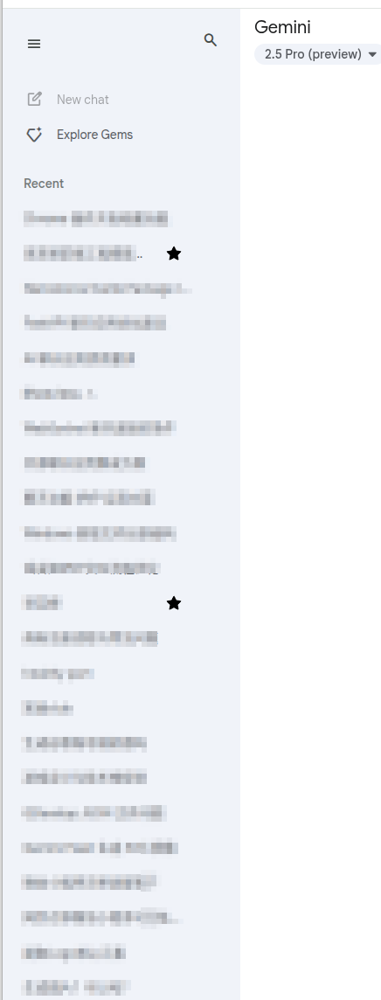

# 🌟 Gemini Chat Favorites Chrome Extension

**Gemini Chat Favorites** is a Chrome extension designed for [gemini.google.com](https://gemini.google.com), allowing you to easily mark and quickly revisit important chat conversations to boost your productivity.

---

## 🔑 Key Features

### ⭐ Favorite/Unfavorite

* Adds a star icon to each chat history item.
* Click the star to toggle the conversation as “favorited” or “unfavorited.”

### 📌 Persistent Visibility for Favorites

* Star icons remain visible at all times for favorited conversations—no need to hover.

### 🖱️ Hover-to-Show for Non-Favorites

* For unfavorited items, the star icon appears on hover.
* Positioned neatly to the left of the three-dot menu for a clean layout.

### 🎨 Customizable Appearance

* Favorited items are highlighted with a light blue star for clear visual distinction.

### 💾 Local Storage

* Favorite status is saved using `chrome.storage.local`.
* Your preferences persist across sessions—even after browser restarts.

### ⚙️ Dynamic Content Handling

* Works seamlessly with dynamically loaded chat history items.
* Ensures all entries remain interactive and responsive.

---

## 🎯 Why Use Gemini Chat Favorites?

* Organize your chat history more efficiently.
* Instantly access your most-used or most-relevant conversations.
* Lightweight and intuitive—enhances your workflow without cluttering the UI.

---

📌 **Upgrade your Gemini experience—starting now!**

---

